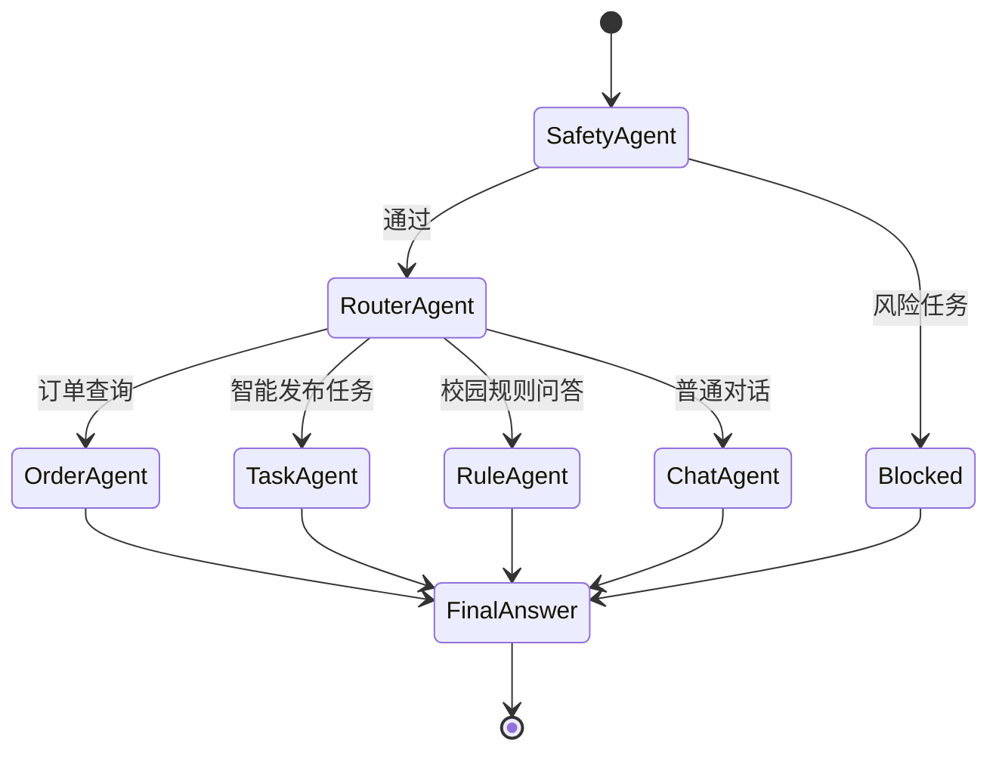

# AI Agent 状态机

AI 助手不是直接把所有问题丢给大模型，而是经过固定状态机。



## Agent 分工

- `SafetyAgent`: 检查替考、买烟酒、危险品、刷单等风险内容。
- `RouterAgent`: 判断用户意图，路由到订单、发布任务、规则问答或普通聊天。
- `OrderAgent`: 调用订单 Tool 查询 Spring Boot 内部接口，结果来自 MariaDB。
- `TaskAgent`: 从自然语言中解析任务标题、描述、赏金，并调用后端发布任务。
- `RuleAgent`: 从 ChromaDB 检索校园规则，必要时调用 BGE Reranker 精排，然后生成带来源的回答。
- `ChatAgent`: 处理普通问答，不允许编造订单状态和学校规定。

## Tool 调用链路示例

用户问：`我的订单状态`

```text
微信小程序
  -> Spring Boot /api/ai/ask
  -> FastAPI SafetyAgent
  -> RouterAgent 判断为 order_list
  -> OrderAgent 调 get_my_orders
  -> Spring Boot /api/internal/order/mine?userId=1
  -> MariaDB 查询 orders + task
  -> AI 组织回答
  -> SSE 返回小程序
```

用户说：`帮我发一个去三食堂买饭的跑腿，赏金5块`

```text
SafetyAgent 检查风险
  -> RouterAgent 判断为 task_publish
  -> TaskAgent 解析 title/reward
  -> publish_runner_task Tool
  -> Spring Boot /api/internal/task/publish
  -> 写入 task 表并生成 orders 记录
  -> 返回订单号和状态
```

## 幻觉控制

订单状态、订单号、接单人只能来自 Tool 查询结果。校园规则回答必须基于 ChromaDB 检索结果并带来源。风险任务直接拒绝，不交给大模型自由发挥。
