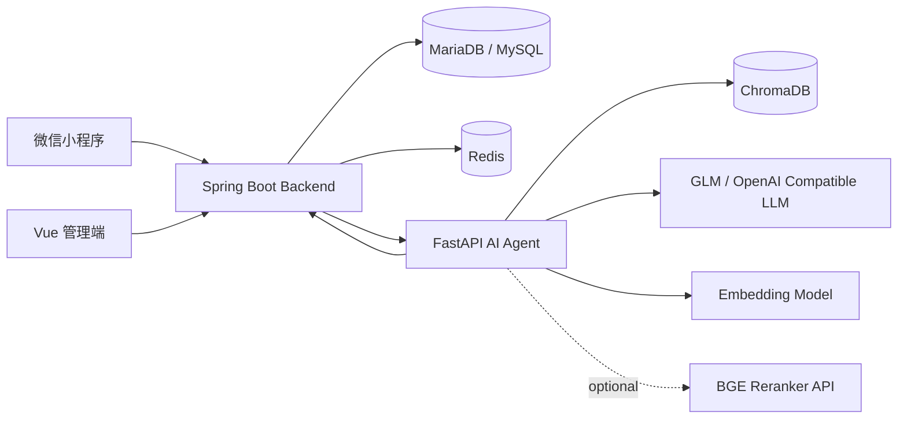

# 系统架构

Campus Runner 是一个校园跑腿 + AI Agent 问答系统。

## 模块职责

- `frontend/miniprogram`: 用户端，登录、发布任务、接单、评价、AI 助手。
- `frontend/web-client`: 管理端，管理用户和订单。
- `backend`: 业务核心，负责用户、任务、订单、评价、权限校验和数据库访问。
- `ai-rag`: AI Agent 服务，负责意图路由、Tool 调用、校园规则 RAG、风险拦截。
- `MariaDB`: 存储用户、任务、订单和评价。
- `Redis`: 本地缓存能力预留。
- `ChromaDB`: 存储校园规则制度文档向量。

## 为什么 Spring Boot + FastAPI

Spring Boot 管业务一致性和数据库写入，FastAPI 管 AI 编排和模型生态。AI 服务不直接操作数据库，而是通过 Spring Boot 内部接口调用业务能力，避免绕过权限和业务规则。
